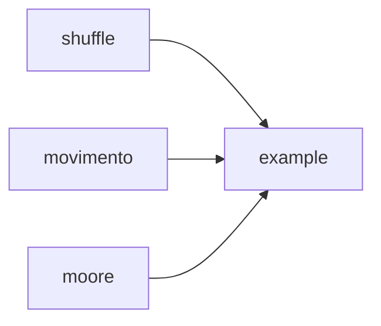

# 2º Projeto de Introdução à Computação 2017/2018

## Índice

 **1.** Introdução 
 **2.** Ficheiros do projeto
 **3.** Descrição da solução
 **4.** Manual de utilizador
 **5.** Conclusões e dificuldades
 **6.** Anexo / Referências

## Introdução

Neste projeto foi-nos pedido que fizéssemos um jogo em C que simulasse um cenário em que humanos (H) eram perseguidos por zombies (Z). Este deveria ser concebido numa grelha 2D tiroidal e utilizando dimensões X e Y e a vizinhança de Moore. Para além disto era pedido ainda que os agentes (humanos e zombies) fossem espalhados pela grelha sempre que o programa fosse iniciado, que fosse implementada uma IA (Inteligência Artificial) básica e que houvessem dois modos de jogo diferentes: um automático e um interativo.

> **Nota:** O jogo não foi finalizado.

## Ficheiros

### Do projeto:

 - example.c
 - example.h
 - example.o
 - example
 - ini.c
 - ini.o
 - jogo.ini
 - moore.c
 - moore.h
 - moore.o
 - movimento.c
 - movimento.h
 - movimento.o
 - showworld.h
 - showworld_simple.c
 - showworld_simple.o
 - shuffle.c
 - shuffle.h
 - shuffle.o
 - rect.png

### Outros:

 - README. md
 - Makefile
 - Doxyfile

## Descrição da solução

Relação entre ficheiros:

> **Nota:** O jogo não foi finalizado, por isso não foi possível chegar a uma solução.

## Manual de utilizador

 **1.** Para criar uma *build* do jogo é necessário executar o seguinte comando no **terminal**:

    $ make

 **2.** Como jogar:

> **Nota:** Visto que o jogo não foi finalizado, não foi possível acabar o manual.

## Conclusões e dificuldades

O projeto embora ambicioso e interessante era bastante complexo. Como tal, apareceram bastantes obstáculos. Alguns foram ultrapassados mas muitos acabaram por se manter, dificultando assim a continuação do desenvolvimento do mesmo.
No entanto, foram feitos progressos e muito foi aprendido, visto que o projeto nos permitiu treinar vários aspetos na utilização da linguagem C (como utilização de apontadores, *enums* e *structs*, embora os mesmos nem sempre tenham sido utilizados), do terminal de Ubuntu, nomeadamente na compilação de vários ficheiros, utilização de makefiles e navegação no mesmo.

## Anexo / Referências

**Fontes utilizadas durante o desenvolvimento do projeto:**

 - https://www.tutorialspoint.com/cprogramming/c_structures.htm
 - https://www.programiz.com/c-programming/c-pointers
 - https://www.tutorialspoint.com/cprogramming/c_pointers.htm
 - https://boredzo.org/pointers/
 - https://stackoverflow.com/questions/37538/how-do-i-determine-the-size-of-my-array-in-c
 - https://stackoverflow.com/questions/6127503/shuffle-array-in-c
 - https://stackoverflow.com/questions/42645455/shuffling-an-array-of-struct-in-c
 - https://stackoverflow.com/questions/34203053/shuffle-multidimensional-array-in-c
 - https://stackoverflow.com/questions/2280352/use-an-ini-file-in-c-on-linux
 - http://www.ncbr.muni.cz/~martinp/g2/index.html

## Metadados:

**Docente:** Nuno Fachada
    
**Discente:** Rodrigo Garcia nº 21704304
**Discente:** Tiago Alves nº 21701031

**Curso:** Licenciatura em Aplicações Multimédia e Videojogos
**Instituição:** Universidade Lusófona de Humanidades e Tecnologias

